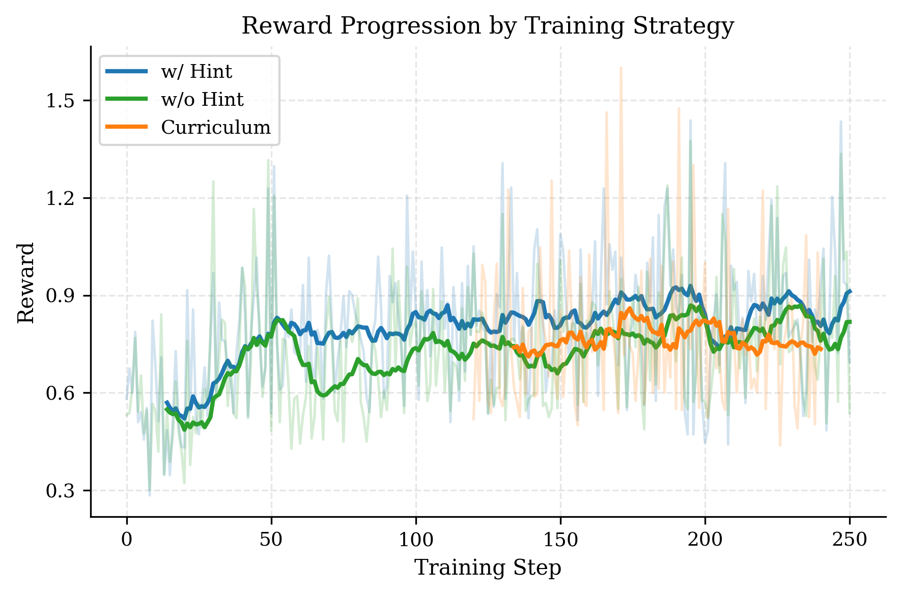

# Improving LLM Agents With Reinforcement Learning on Cryptographic CTF Challenges

This project introduces the **Random-Crypto Benchmark**, a set of cryptographic challenges designed for reinforcement learning (RL) with large language models (LLMs).
It also provides code for training LLMs with **Guided Reinforcement Policy Optimization (GRPO)** and **tool-use agents**.

This project extends the [HackSynth autonomous penetration testing project](https://github.com/aielte-research/HackSynth).

---

## 📦 Setup

Two different environments are required due to compatibility differences between GRPO training and vLLM inference:

1. **Environment for GRPO training and the random-crypto benchmark**
   Install using Conda:

   ```bash
   conda install environment.yaml
   ```

2. **Environment for vLLM inference**
   Set up a Python virtual environment:

   ```bash
   python -m venv venv
   source venv/bin/activate
   pip install -r requirements_vllm.txt
   ```

Additionally, create a `.env` file with the required environment variables for the project (see example_env).

---

## 🚀 Usage

### Evaluating LLMs (No Tool Use)

Use `eval_llm.py` to evaluate LLMs without tool use:

```bash
python eval_llm.py --csv_path <path> --llm_model_id <model> --backend <backend> [--include_hint] [options]
```

**Arguments**:

* `--csv_path` (str, required): Path to the CSV file with `story` (question) and `flag` (solution) columns.
* `--llm_model_id` (str, required): Model identifier (e.g., `gpt-4o` or a vLLM checkpoint path).
* `--backend` (str, required): `vllm`, `openai`, or `groqcloud`.
* `--include_hint`: Whether to concatenate the hint to the question.
* `--n_samples` (int, default=8): Number of generations per query.
* `--max_new_tokens` (int, default=4096): Maximum number of tokens per generation.
* `--temperature` (float, default=0.6): Sampling temperature.
* `--top_p` (float, default=0.9): Nucleus sampling parameter.

---

### Evaluating Tool-Use Agents

Use `eval_agent.py` to evaluate LLMs with tool use:

```bash
python eval_agent.py --model_id <model> --data_path <path> --backend <backend> --output_dir <dir> [options]
```

**Arguments**:

* `--model_id` (str, required): Hugging Face model ID or local path.
* `--data_path` (str, required): Path to the dataset CSV.
* `--backend` (str, required): `local`, `vllm`, or `openai`.
* `--output_dir` (str, required): Directory to save evaluation results.
* `--include_hint`: Include hints if available.
* `--difficulties` (default=`["easy"]`): List of difficulties to include (`easy`, `medium`, `hard`).
* `--lora_path` (str, optional): Path to an existing LoRA adapter.

---

### Training an LLM Agent with GRPO

Use `train_agent.py` to train an agent with GRPO:

```bash
python train_agent.py --model_id <model> --data_path <path> --output_dir <dir> [options]
```

**Arguments**:

* `--model_id` (str, required): Hugging Face model ID (e.g., `meta-llama/meta-Llama-3.1-8B-Instruct`).
* `--data_path` (str, required): Path to the training dataset CSV.
* `--output_dir` (str, required): Directory to save training outputs.
* `--include_hint`: Include hint in prompts if available.
* `--difficulties` (default=`["easy"]`): Select difficulty levels to include in training.
* `--lora_path` (str, optional): Path to a LoRA adapter for continued training.

---

## 📊 Results

### Random-Crypto Benchmark

<p align="center">
  <br>
  <em>Performance of LLMs on the benchmark</em>
</p>

Tool-augmented agents significantly outperform their vanilla counterparts, with larger models like o3 demonstrating the best performance across cryptographic CTF challenges.


### Reinforcement Learning
<p align="center">
  
</p>

Reinforcement learning with GRPO steadily improved agent performance, enhancing both tool-use reliability and generalization to external benchmarks like picoCTF.


---

## Contributors
- Lajos Muzsai (muzsailajos@protonmail.com)
- David Imolai (david@imol.ai)
- András Lukács (andras.lukacs@ttk.elte.hu)

---
## How To Cite

TODO: Insert citation lated

--

## 🏆 Credits

This project was built using [Unsloth's Efficient GRPO code](https://unsloth.ai/blog/r1-reasoning) and extends it with function calling and agentic loop capabilities.
The MCP server was built using [Python REPL MCP Server](https://github.com/hdresearch/mcp-python), however slight modifications had to be made the sandbox the executed code.

---
## License
The project uses the MIT license.
