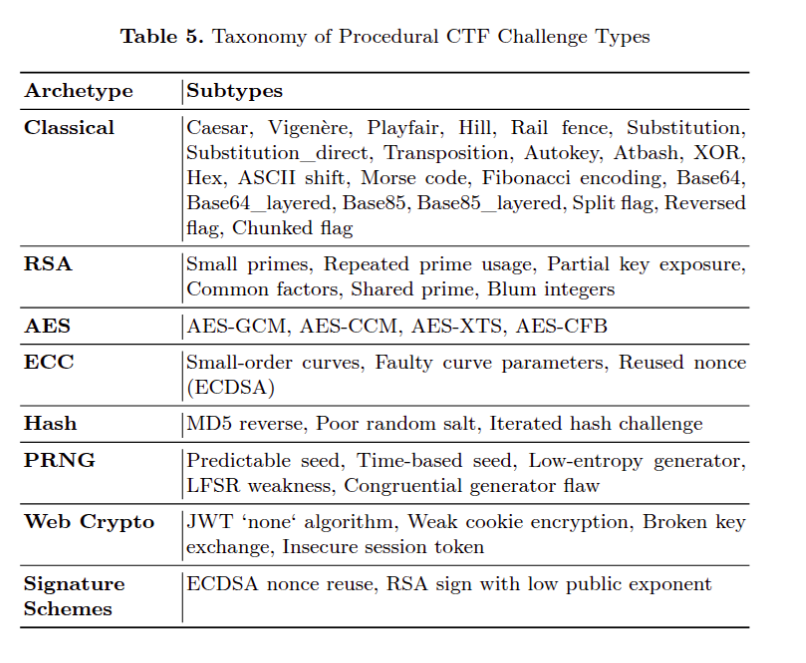

# Random-Crypto Benchmark

This repository provides a **procedural cryptography challenge benchmark** for evaluating Large Language Models (LLMs) on cryptographic reasoning tasks. 

It includes:
- **50 human-verified** cryptography challenges for reliable testing.
- **5000 procedurally generated** challenges for large-scale training.

The benchmark is designed to assess LLMs on their cryptography problem-solving ability.

---

## How to Generate Challenges

You can generate new procedural challenges using `main.py`. This script allows you to control the number of challenge variants created.

### Arguments

- `--variants`:  
  Number of variants per challenge subtype.  
  **Default**: `1`  
  (Total challenges generated = `variants × 50`)

- `--output_folder`:  
  Folder where the generated challenges and metadata will be saved.  
  **Default**: `"generated_challenges_llm"`

### Example Usage

```bash
python main.py --variants 1 --output_folder my_generated_challenges
```

## Benchmark details

<p align="center">
  
</p>
